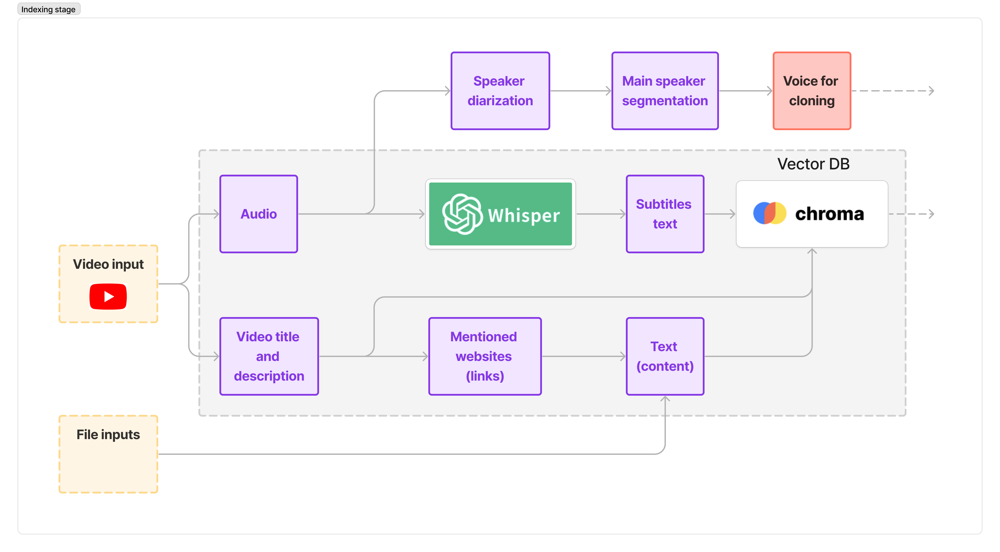
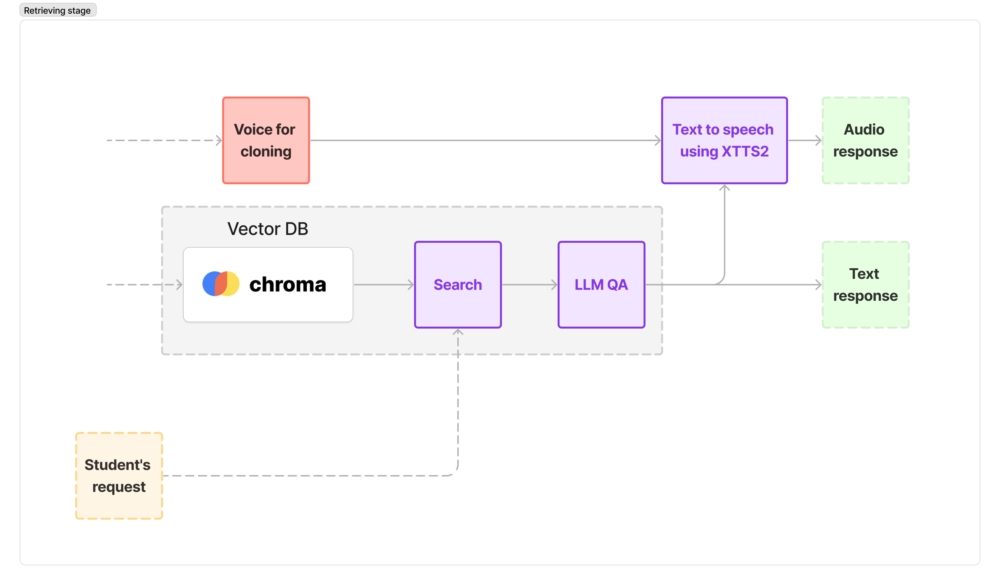

# ConsultAudio project demo

**by Andrii Shevtsov, Yaroslav Prytula, Viacheslav	Hodlevskyi**

## Main idea

**ConsultAudio** is a personal assistant for lecturers, allowing them to answer many direct messages after lectures without much effort. Also, it will enable people to get answers from lecturers who are not reachable to them: those who are too busy, too high-level, or who have passed away.

The project clones the lecturer's voice and tries to capture his answering style. It uses the lecture and supplementary materials from YouTube video descriptions and PDFs.

## Demo videos

Demo 1 (click on the image to watch the YouTube video):

[](https://youtu.be/N0XfxP9irpA)

Demo 2 (click on the image to watch the YouTube video):

[](https://youtu.be/gexeEqa0SiU)

## How to run it?

### Environment setup

We are using Python's native virtual environments along with pip package manager and `requirements.txt` files.

To run the project, create a virtual environment via `python<version> -m venv .venv`.

Then, activate the environment:
- On Linux/Mac: `source .venv/bin/activate`.
- On Windows: `.venv/Scripts/activate.bat`.

And install `requirements.txt`:
```
pip install -r requirements.txt
```

Then, fill `.env` environment file, like the `sample.env` file is filled:
```
SAVE_PATH=./data/audios

HUGGINGFACEHUB_API_TOKEN=<your_token(with_write_access)_here>
OPENAI_API_KEY=<your_key_here>
```

### Run the UI

To run the UI after the environment is set up, you can just run it with Python:
```
python gradio_ui.py
```

## Main architecture 

The architecture here consists of two main parts: indexing and retrieval. The first allows us to store all the needed data for the RAG system, and the second uses the first to answer the user's question and convert the answer to the lecturer's voice.





LLM QA is possible here with two models: GPT-3.5 and Gemma-2b for now. Gemma's context length and ability to understand context are pretty low for now, but they allow us to have a local model performing the crucial task.

### Folder structure

- `components` folder contains the main RAG pipeline, YouTube parsing, and TTS parts.
- `data` folder stores audio, transcriptions, and other data.
- `images` is supplementary folder to store Readme images.
- `notebooks` folder contains notebooks with experiments that lay behind the whole model.

## Following steps

- [ ] Add separate demos for adding materials to DB and using them.
- [ ] Add OCR for frames for better video understanding.
- [ ] Assure better DB usage: a person who wants to get info from one lecturer shouldn't get info from others' lectures.

## Acknowledgements

Thanks to [AI House](https://aihouse.org.ua/en/), [Ukrainian Catholic University](https://ucu.edu.ua/en/), [Faculty of Applied Sciences of UCU](https://apps.ucu.edu.ua/en/) for organizing Generative AI Spring School. Also, thanks to the school's partners: GlobalLogic, SoftServe, Skylum, and ADVA Soft.

Special thanks to [Ampersand Education Foundation](https://ampersand.foundation/) which allows me (Andrii Shevtsov, PrometheusUA) to obtain my education at the Ukrainian Catholic University.